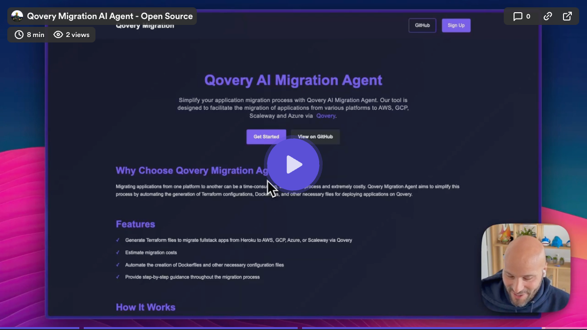

# Qovery Migration AI Agent

Qovery Migration AI Agent is an app designed to facilitate the migration of applications from various platforms to Qovery. Currently, it supports migrating Heroku applications to AWS, GCP, or Scaleway using Qovery.

## Why this tool?

Migrating applications from one platform to another can be a time-consuming, error-prone process and super costly $$$. Qovery Migration AI Agent aims to simplify this process by automating the generation of Terraform configurations, Dockerfiles, and other necessary files for deploying applications on Qovery.

## Features

> Note: This project is still in development and may not support all features yet.

- Migrate Heroku/Render applications to AWS, GCP, Azure or Scaleway via Qovery
- Generate Terraform configurations for Qovery deployments
- Create Dockerfiles for migrated applications

## Structure

The project is structured as follows:

- [CLI](cli): Contains the command-line interface for the migration agent (can be used on your local machine)
- [Web](web): Contains the web interface for the migration agent (can be deployed on a server)

### Environment Variables

The following environment variables are required to run the application:

| Environment Variable    | Description                                                                | Required           |
|-------------------------|----------------------------------------------------------------------------|--------------------|
| `AWS_ACCESS_KEY_ID`     | AWS access key ID for Bedrock service                                      | Yes                |
| `AWS_SECRET_ACCESS_KEY` | AWS secret access key for Bedrock service                                  | Yes                |
| `AWS_REGION`            | AWS region where Bedrock service is available (e.g., us-east-1, us-west-2) | Yes                |
| `HEROKU_API_KEY`        | Heroku API key                                                             | Yes if you used it |
| `GITHUB_TOKEN`          | GitHub token to avoid being rate limited                                   | No                 |

> Note: Make sure your AWS credentials have the necessary permissions to access the Bedrock service and the Claude model.

## How it works

The migration agent uses the Heroku (or other provider) API to fetch information about the application to be migrated. It then uses Claude AI via AWS Bedrock to generate Terraform configurations for deploying the application on Qovery. The generated Terraform configurations include the necessary resources such as the application, environment, database, and other services.

## Security

- This application does not store any user credentials.
- All code is open-source and can be audited.
- AWS credentials are only used locally and are never transmitted to third parties.
- For more information, see the Security page in the application.

## Contributing

We welcome contributions! Please see our [Contributing Guide](CONTRIBUTING.md) for more details.

## License

This project is licensed under the MIT License - see the [LICENSE](LICENSE) file for details.

## Support

If you encounter any issues or have questions, please file an issue on the GitHub repository or contact support@qovery.com.