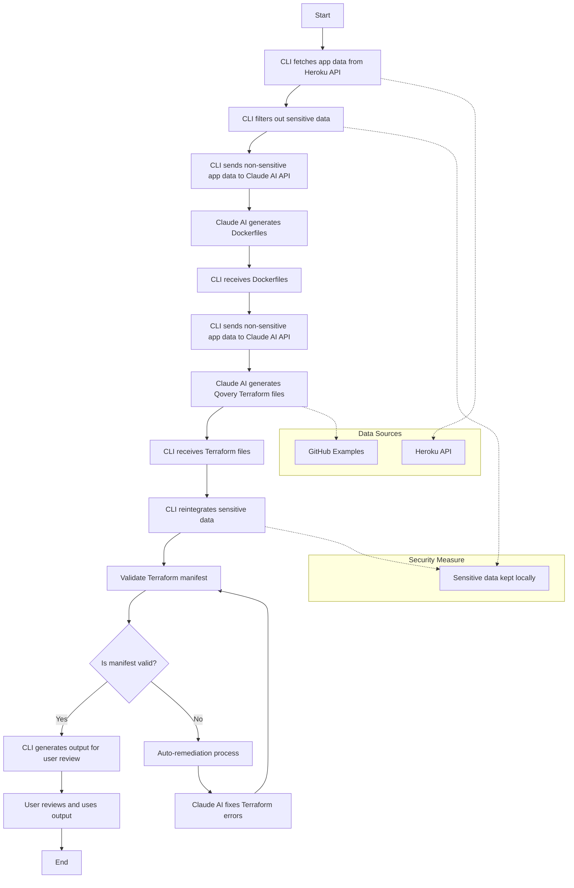

# Qovery AI Migration Agent CLI

Qovery AI Migration Agent CLI is a command-line tool designed to facilitate the migration of applications from various platforms to Qovery. Currently, it supports migrating Heroku applications to AWS, GCP, or Scaleway using Qovery.

## Prerequisites

- Go 1.16 or later
- Heroku API Key
- Claude API Key
- Qovery API Key

## Installation

1. Clone the repository:
```
git clone https://github.com/yourusername/qovery-migration-agent.git
```

2. Change to the project directory:
```
cd qovery-migration-agent
```

3. Build the project:
```
go build -o qovery-migration-agent
```

## Usage

1. Set up your environment variables in a `.env` file (or export them in your shell):
```
HEROKU_API_KEY=your_heroku_api_key
CLAUDE_API_KEY=your_claude_api_key
QOVERY_API_KEY=your_qovery_api_key
```

2. Run the migration command:
```
./qovery-migration-agent migrate --from heroku --to aws --output /path/to/output
```

Replace `aws` with `gcp` or `scaleway` as needed.

3. You can now deploy the generated Terraform configurations to Qovery.

```bash
cd /path/to/output

terraform init
terraform apply
```

## How it works

The migration agent uses the Heroku (or other provider) API to fetch information about the application to be migrated. It then generates Terraform configurations for deploying the application on Qovery. The generated Terraform configurations include the necessary resources such as the application, environment, database, and other services.


